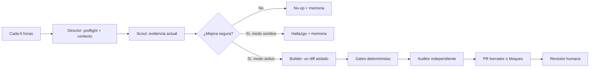

# Sistema de mejora autónoma de Obraxen

> Este documento describe arquitectura y decisiones de diseño. No es una
> autorización de ejecución. Para saber qué puede hacer una tarea, prevalecen
> `AGENTS.md`, `COORDINATION.md`, la política/runtime y el registro operativo.

## Objetivo y límite

El sistema puede observar la web, recordar resultados, proponer una mejora,
validarla y repetir el ciclo sin presencia humana. No puede convertir actividad
en calidad por sí sola: `no_op` es un resultado correcto cuando no existe una
mejora pequeña, demostrable y segura.

La autonomía no incluye selección de identidad, afirmaciones comerciales,
legal, publicación, merge ni despliegue. Esas decisiones siguen siendo humanas.
Una ejecución continua tampoco es literalmente ilimitada: depende de un runner,
credenciales, cuota, presupuesto y proveedores disponibles.

## Los cuatro agentes

1. **Director**: carga política, preflight y memoria; decide si hay trabajo y
   conserva el estado de la ejecución.
2. **Scout**: inspecciona en lectura, aporta hasta tres hallazgos actuales y
   reproducibles y puede recomendar `no_op`.
3. **Builder**: único escritor; solo existe en modo activo, con lease, claim,
   worktree aislado y rutas exactas.
4. **Auditor**: revisa el diff y las verificaciones de forma independiente; su
   veto bloquea la ejecución y nunca repara su propio hallazgo.



## Memoria duradera, no autoridad duradera

`automation/agents/memory.mjs` aplica dos niveles:

- **episódico**: informe completo e inmutable de cada ejecución;
- **semántico operativo**: índice acotado de ejecuciones recientes, hallazgos
  abiertos, frecuencia y telemetría realmente medida.

Los datos viven bajo el directorio Git común, fuera de los commits, para que
todos los worktrees compartan historia sin contaminar el repositorio. El
contexto entregado a un agente está limitado por tamaño y relevancia. Un
hallazgo observado en otro SHA se marca para revalidación.

La memoria nunca sustituye a Git, las claims, la política ni una medición
actual. Las reglas aprendidas se guardan en cuarentena, no se presentan como
instrucciones y solo pueden promoverse mediante un cambio revisado por una
persona. Esto evita que una conclusión equivocada se auto-refuerce en bucle.

## Presupuesto de atención 70/20/10

Los ciclos autónomos programados siguen una secuencia fija de diez turnos:
siete para producto, dos para fiabilidad y uno para mantenimiento de agentes.
Producto cubre evidencia, UX, accesibilidad, SEO, localización y rendimiento;
fiabilidad cubre seguridad, pruebas, fiabilidad y mantenibilidad fuera del plano
de agentes. Si una candidata toca rutas del propio sistema de agentes, cuenta
como mantenimiento de agentes aunque su dominio sea otro.

La memoria indica la categoría exacta del siguiente turno y rechaza un informe
programado que intente usar otra. Un `no_op` válido también consume el turno:
no encontrar trabajo no permite repetir la categoría ni cambiar a otra. Las
peticiones humanas, la entrega y el mantenimiento solicitado se registran con
su categoría real, pero no desplazan el contador autónomo.

## Máquina de estados

```text
disabled
  └─ no ejecuta agentes

shadow
  ├─ blocked
  ├─ no_op
  └─ shadow_finding

active
  ├─ blocked
  ├─ no_op
  ├─ local_diff
  └─ draft_pr
```

El modo y las capacidades son distintos. Estar en `active` no permite por sí
solo escribir, commitear, subir o abrir un PR: cada acción requiere su propia
bandera en `policy.json`. `allowMerge`, `allowDeploy` y `allowPublish` se
mantienen siempre en `false`.

Una aprobación humana puede conceder una excepción estrecha sin cambiar esas
banderas: `authorizations.mjs` registra una secuencia exacta y contigua de
commit de candidata, push de su rama y creación de PR borrador. La autorización
fija repositorio, candidata, SHA base, rama `codex/`, rutas exactas sin
comodines, activación, checks, orden y
caducidad máxima de 24 horas. Cada paso usa una reserva de un solo consumo y
queda registrado fuera del checkout en una cadena inmutable.

El agente no puede deducir, ampliar ni crear por sí mismo esa aprobación. Una
reserva caducada o cualquier cambio de contexto detiene la secuencia sin
reintento automático. Merge, despliegue, publicación, borrado y rollback
destructivo no pueden formar parte del bundle y siempre exigen otra decisión
humana.

## Migraciones de criterios de activacion

El propietario puede solicitar que requisitos empresariales concretos pasen de
bloqueos a advertencias. La candidata debe enumerar reglas retiradas y
conservadas, mantener visibles los hechos no acreditados y comparar la
activacion antes y despues. No activa `publicar`, no inventa aprobaciones y no
concede merge, despliegue o publicación.

## Un ciclo completo

1. Fija el SHA y lee todos los worktrees, claims y leases.
2. Recupera solo contexto relevante y lo marca como no autoritativo.
3. El director fija la categoría del turno y el scout vuelve a medir solo ese
   ámbito.
4. El director selecciona cero o un hallazgo.
5. En sombra, termina y registra el informe. En activo, crea un único entorno
   aislado y reserva rutas exactas.
6. El builder realiza una sola mejora y una corrección como máximo. Si la
   corrección falla, no continúa en bucle ni declara éxito: registra el comando
   fallido, el riesgo residual y un estado `blocked` para revisión humana.
7. Los scripts verifican rutas, tamaño, diff completo, tests y calidad. La
   activación debe permanecer igual salvo en una migración solicitada por el
   propietario, donde se revisa la diferencia completa.
8. El auditor aprueba, veta o pide revisión humana.
9. El director persiste un informe validado e idempotente, avanza el presupuesto
   si era un ciclo programado, libera recursos y termina. La siguiente ejecución
   recibe la historia relevante.

## Ejecución local y alojada

- **Local**: una tarea de Codex se despierta cada seis horas. Es barata y usa el
  entorno ya configurado, pero deja de ejecutarse si el Mac o Codex no están
  disponibles.
- **Alojada**: el workflow fuente de GitHub puede ejecutarse aunque el Mac esté
  apagado. Requiere una credencial de inferencia, cuota y presupuesto. Empieza
  en sombra/manual, usa memoria de repositorio y limita las salidas seguras.

No se usan dos escritores a la vez. Antes de activar el runner alojado como
escritor, ambos entornos deben compartir el mismo control de concurrencia y el
flujo local debe quedar en sombra o deshabilitado para escritura.

## Promoción gradual

1. Tres canarios en sombra revisados y sin mutaciones.
2. Evals de conflictos, inyección, evidencia, SHA obsoleto, memoria, gates y
   `no_op`.
3. Runner alojado en sombra con límites de tiempo, turnos y coste.
4. `active + allowLocalDiff`, todavía sin commit ni PR.
5. PR borrador de una sola mejora, con Quality gate verde para el SHA exacto.
6. Revisión humana. Nunca merge, despliegue o publicación automáticos.

Estado local actual: completados tres canarios sombra sobre el mismo SHA (un
`no_op` y dos confirmaciones independientes deduplicadas del mismo hallazgo) y
habilitado el paso 4. Cada ciclo puede producir un único diff local aislado; no
puede commitearlo, subirlo ni abrir un PR. El workflow alojado sigue manual y en
sombra. Solo un controlador actuando sobre una autorización humana agrupada y
exacta puede realizar esos pasos para una candidata concreta.

Una promoción se revierte ante mutación fuera de alcance, evidencia inventada,
reutilización conflictiva de `runId`, aumento de fallos de contrato, coste sin
medir o regresión de calidad.

## Observabilidad y evaluación

Cada informe registra estado, SHA, huella de runtime, hallazgo, conflictos, bloqueos, rutas,
checks, auditoría, acción externa, reglas propuestas, traza y telemetría. Cada
mejora seleccionada conserva además un `candidateId` y encadena sus fases con
`parentRunId`, de forma que descubrimiento, implementación, revisión, entrega y
cierre sean una sola candidata y no observaciones duplicadas. Los valores no
expuestos por el runtime se guardan como `null`, no como estimaciones.

Cada ejecución declara además su origen: `scheduled_autonomous` para un ciclo
programado sin petición humana en esa ejecución, `human_directed` para trabajo
pedido por una persona, `control_plane_maintenance` para cambios del propio
sistema de agentes y `delivery` para commit, push, PR, reconciliación o cierre.
Las métricas operativas incluyen los cuatro orígenes, pero la eficacia autónoma
usa exclusivamente ejecuciones y candidatas iniciadas como
`scheduled_autonomous`. El trabajo humano, el mantenimiento y la entrega no
pueden mejorar artificialmente esa medida.

La evidencia de cada hallazgo conserva uno de cinco tipos no convertibles:
hecho del repositorio, resultado de comando, declaración humana, documento
referenciado o revisión profesional. Una declaración mantiene su texto y
referencia exactos, pero no acredita por sí misma el documento o la revisión que
mencione. Estos dos últimos niveles exigen identificadores propios; una revisión
profesional exige además revisor, fecha y decisión.

El commit final, la pull request y la decisión de revisión se conservan como
datos declarados del linaje. No se consideran verdad operativa hasta que un
reconciliador separado los contraste con Git y GitHub.

Ese reconciliador es determinista y no es otro agente. Comprueba la existencia
del commit local, la identidad y SHA de cabeza de la PR, el commit de merge, su
presencia en `main`, la decisión declarada y el `Quality gate` exacto. La
evidencia remota llega como JSON de solo lectura desde un entorno autorizado;
el reconciliador no obtiene red propia y no realiza acciones en GitHub.

Los cierres posibles son `merged`, `rejected` y `superseded`. Una PR cerrada sin
decisión explícita sigue necesitando clasificación humana. `regressed` reabre el
hallazgo únicamente cuando una verificación originalmente declarada falla en el
SHA actual de `main`; no se deduce por semejanza textual ni por un fallo de CI
no relacionado. Cada observación se guarda como evidencia inmutable fuera del
árbol versionado.

El estado operativo de una claim tampoco se reescribe despues de registrarla.
Un log append-only en la coordinacion compartida conserva cada transicion ligada
al checksum del marcador inicial, las rutas exactas y el evento anterior. El
preflight superpone el ultimo evento valido y falla cerrado ante corrupcion,
bifurcacion, predecesores ausentes o cambios posteriores del marcador.

Una liberacion exige evidencia tipada: reconciliacion terminal, PR fusionada,
informe inmutable `no_op`, checksum de handoff o decision humana. Una PR cerrada
sin fusionar o un informe `blocked` no bastan por si solos. El estado post-merge
se registra ahi o permanece en la evidencia de la PR; no se crea una segunda PR
dedicada solo a cambiar claim y handoff. Reabrir una claim liberada exige una
decision humana identificable.

La estrategia sigue las recomendaciones de las guías oficiales de OpenAI:
sesiones persistentes y compactación, memoria separada del historial de
conversación, trazas, aprobaciones duraderas y evals continuas calibradas con
revisión humana.

Referencias primarias:

- [OpenAI Agents SDK: sessions](https://openai.github.io/openai-agents-python/sessions/)
- [OpenAI Agents SDK: agent memory](https://openai.github.io/openai-agents-python/sandbox/memory/)
- [OpenAI Agents SDK: tracing](https://openai.github.io/openai-agents-python/tracing/)
- [OpenAI Agents SDK: human in the loop](https://openai.github.io/openai-agents-python/human_in_the_loop/)
- [OpenAI: agent evals](https://developers.openai.com/api/docs/guides/agent-evals)
- [OpenAI: evaluation best practices](https://developers.openai.com/api/docs/guides/evaluation-best-practices)
- [GitHub Agentic Workflows: repository memory](https://github.github.com/gh-aw/reference/repo-memory/)
- [GitHub Agentic Workflows: safe outputs](https://github.github.com/gh-aw/reference/safe-outputs/)

## Recuperación

Los informes episódicos son inmutables. Un `runId` repetido con el mismo
contenido es un reintento idempotente; con contenido diferente se bloquea. Un
`candidateId` repetido debe continuar exactamente desde el último `runId`, no
puede retroceder de fase ni cambiar el alcance del hallazgo. El estado legado de
memoria v1 a v4 se lee sin fabricar linaje, reconciliación, origen o huella de
runtime históricos. Sus valores desconocidos se conservan como `unknown` o
`null`, fuera de la eficacia autónoma, y se convierte a v6 al registrar el
siguiente informe válido. Un lock o lease viejo
nunca se elimina
automáticamente: se inspeccionan proceso, host, worktree, claim y Git antes de
una recuperación humana.

Comandos de diagnóstico:

```sh
node automation/agents/runtime.mjs exec -- node automation/agents/policy.mjs
node automation/agents/runtime.mjs exec -- node automation/agents/preflight.mjs --json
node automation/agents/runtime.mjs exec -- node automation/agents/operations.mjs status
node automation/agents/runtime.mjs exec -- node automation/agents/authorizations.mjs status
node automation/agents/runtime.mjs exec -- node automation/agents/memory.mjs status
node automation/agents/runtime.mjs exec -- node automation/agents/memory.mjs context --base-sha "$(git rev-parse HEAD)"
```
