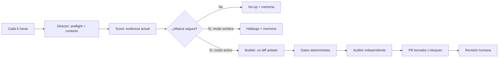

# Sistema de mejora autónoma de Obraxen

## Objetivo y límite

El sistema puede observar la web, recordar resultados, proponer una mejora,
validarla y repetir el ciclo sin presencia humana. No puede convertir actividad
en calidad por sí sola: `no_op` es un resultado correcto cuando no existe una
mejora pequeña, demostrable y segura.

La autonomía no incluye selección de identidad, afirmaciones comerciales,
legal, publicación, merge ni despliegue. Esas decisiones siguen siendo humanas.
Una ejecución continua tampoco es literalmente ilimitada: depende de un runner,
credenciales, cuota, presupuesto y proveedores disponibles.

## Los cuatro agentes

1. **Director**: carga política, preflight y memoria; decide si hay trabajo y
   conserva el estado de la ejecución.
2. **Scout**: inspecciona en lectura, aporta hasta tres hallazgos actuales y
   reproducibles y puede recomendar `no_op`.
3. **Builder**: único escritor; solo existe en modo activo, con lease, claim,
   worktree aislado y rutas exactas.
4. **Auditor**: revisa el diff y las verificaciones de forma independiente; su
   veto bloquea la ejecución y nunca repara su propio hallazgo.



## Memoria duradera, no autoridad duradera

`automation/agents/memory.mjs` aplica dos niveles:

- **episódico**: informe completo e inmutable de cada ejecución;
- **semántico operativo**: índice acotado de ejecuciones recientes, hallazgos
  abiertos, frecuencia y telemetría realmente medida.

Los datos viven bajo el directorio Git común, fuera de los commits, para que
todos los worktrees compartan historia sin contaminar el repositorio. El
contexto entregado a un agente está limitado por tamaño y relevancia. Un
hallazgo observado en otro SHA se marca para revalidación.

La memoria nunca sustituye a Git, las claims, la política ni una medición
actual. Las reglas aprendidas se guardan en cuarentena, no se presentan como
instrucciones y solo pueden promoverse mediante un cambio revisado por una
persona. Esto evita que una conclusión equivocada se auto-refuerce en bucle.

## Máquina de estados

```text
disabled
  └─ no ejecuta agentes

shadow
  ├─ blocked
  ├─ no_op
  └─ shadow_finding

active
  ├─ blocked
  ├─ no_op
  ├─ local_diff
  └─ draft_pr
```

El modo y las capacidades son distintos. Estar en `active` no permite por sí
solo escribir, commitear, subir o abrir un PR: cada acción requiere su propia
bandera en `policy.json`. `allowMerge`, `allowDeploy` y `allowPublish` se
mantienen siempre en `false`.

## Un ciclo completo

1. Fija el SHA y lee todos los worktrees, claims y leases.
2. Recupera solo contexto relevante y lo marca como no autoritativo.
3. El scout vuelve a medir el estado actual.
4. El director selecciona cero o un hallazgo.
5. En sombra, termina y registra el informe. En activo, crea un único entorno
   aislado y reserva rutas exactas.
6. El builder realiza una sola mejora y una corrección como máximo.
7. Los scripts verifican rutas, tamaño, diff completo, tests, calidad y que el
   estado de activación no haya cambiado.
8. El auditor aprueba, veta o pide revisión humana.
9. El director persiste un informe validado e idempotente, libera recursos y
   termina. La siguiente ejecución recibe la historia relevante.

## Ejecución local y alojada

- **Local**: una tarea de Codex se despierta cada seis horas. Es barata y usa el
  entorno ya configurado, pero deja de ejecutarse si el Mac o Codex no están
  disponibles.
- **Alojada**: el workflow fuente de GitHub puede ejecutarse aunque el Mac esté
  apagado. Requiere una credencial de inferencia, cuota y presupuesto. Empieza
  en sombra/manual, usa memoria de repositorio y limita las salidas seguras.

No se usan dos escritores a la vez. Antes de activar el runner alojado como
escritor, ambos entornos deben compartir el mismo control de concurrencia y el
flujo local debe quedar en sombra o deshabilitado para escritura.

## Promoción gradual

1. Tres canarios en sombra revisados y sin mutaciones.
2. Evals de conflictos, inyección, evidencia, SHA obsoleto, memoria, gates y
   `no_op`.
3. Runner alojado en sombra con límites de tiempo, turnos y coste.
4. `active + allowLocalDiff`, todavía sin commit ni PR.
5. PR borrador de una sola mejora, con Quality gate verde para el SHA exacto.
6. Revisión humana. Nunca merge, despliegue o publicación automáticos.

Estado local actual: completados tres canarios sombra sobre el mismo SHA (un
`no_op` y dos confirmaciones independientes deduplicadas del mismo hallazgo) y
habilitado el paso 4. Cada ciclo puede producir un único diff local aislado; no
puede commitearlo, subirlo ni abrir un PR. El workflow alojado sigue manual y en
sombra.

Una promoción se revierte ante mutación fuera de alcance, evidencia inventada,
reutilización conflictiva de `runId`, aumento de fallos de contrato, coste sin
medir o regresión de calidad.

## Observabilidad y evaluación

Cada informe registra estado, SHA, hallazgo, conflictos, bloqueos, rutas,
checks, auditoría, acción externa, reglas propuestas, traza y telemetría. Los
valores no expuestos por el runtime se guardan como `null`, no como estimaciones.

La estrategia sigue las recomendaciones de las guías oficiales de OpenAI:
sesiones persistentes y compactación, memoria separada del historial de
conversación, trazas, aprobaciones duraderas y evals continuas calibradas con
revisión humana.

Referencias primarias:

- [OpenAI Agents SDK: sessions](https://openai.github.io/openai-agents-python/sessions/)
- [OpenAI Agents SDK: agent memory](https://openai.github.io/openai-agents-python/sandbox/memory/)
- [OpenAI Agents SDK: tracing](https://openai.github.io/openai-agents-python/tracing/)
- [OpenAI Agents SDK: human in the loop](https://openai.github.io/openai-agents-python/human_in_the_loop/)
- [OpenAI: agent evals](https://developers.openai.com/api/docs/guides/agent-evals)
- [OpenAI: evaluation best practices](https://developers.openai.com/api/docs/guides/evaluation-best-practices)
- [GitHub Agentic Workflows: repository memory](https://github.github.com/gh-aw/reference/repo-memory/)
- [GitHub Agentic Workflows: safe outputs](https://github.github.com/gh-aw/reference/safe-outputs/)

## Recuperación

Los informes episódicos son inmutables. Un `runId` repetido con el mismo
contenido es un reintento idempotente; con contenido diferente se bloquea. Un
lock o lease viejo nunca se elimina automáticamente: se inspeccionan proceso,
host, worktree, claim y Git antes de una recuperación humana.

Comandos de diagnóstico:

```sh
node automation/agents/policy.mjs
node automation/agents/preflight.mjs --json
node automation/agents/memory.mjs status
node automation/agents/memory.mjs context --base-sha "$(git rev-parse HEAD)"
```
