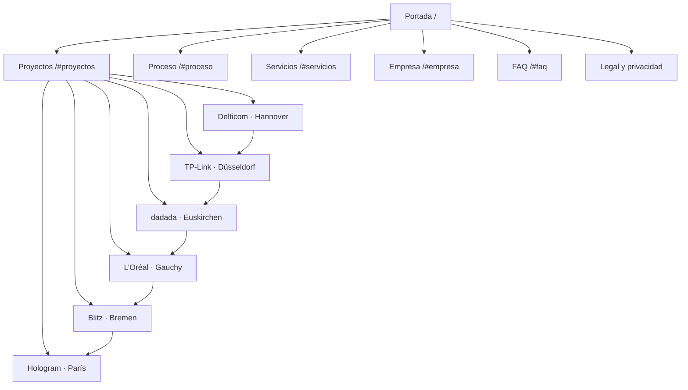

# Arquitectura del sitio

Estado documentado: 14 de julio de 2026. La arquitectura funciona en preview
`noindex,nofollow`; naming, sociedad, dominio y contacto quedan fuera de alcance.

## Jerarquía

```text
Portada (/)
├── Proceso (/#proceso)
├── Servicios (/#servicios)
├── Proyectos (/#proyectos)
│   ├── Delticom Hannover (/proyectos/delticom-hannover/)
│   ├── TP-Link Düsseldorf (/proyectos/tp-link-dusseldorf/)
│   ├── dadada Euskirchen (/proyectos/dadada-euskirchen/)
│   ├── L’Oréal Gauchy (/proyectos/loreal-gauchy/)
│   ├── Blitz Bremen (/proyectos/blitz-bremen/)
│   └── Hologram París (/proyectos/hologram-paris/)
├── Empresa (/#empresa)
├── FAQ (/#faq)
├── Aviso legal (/aviso-legal/)
└── Privacidad (/privacidad/)
```

## Mapa visual



## Mapa de URLs

| Página | URL | Padre | Acceso | Prioridad |
|---|---|---|---|---|
| Portada | `/` | — | Navegación principal | Alta |
| Hub de proyectos | `/#proyectos` | Portada | Navegación y CTA provisional | Alta |
| Caso de proyecto | `/proyectos/{slug}/` | Proyectos | Tarjeta, breadcrumbs y anterior/siguiente | Alta |
| Aviso legal | `/aviso-legal/` | Portada | Pie | Bloqueada |
| Privacidad | `/privacidad/` | Portada | Pie | Bloqueada |

## Navegación

- La portada conserva cinco entradas: Proceso, Servicios, Proyectos, Empresa y FAQ.
- Sin canales de contacto, el CTA principal lleva a Proyectos. Cambia a Contacto
  automáticamente cuando exista email, teléfono o WhatsApp.
- Cada caso incluye breadcrumbs `Inicio > Proyectos > Cliente`.
- Cada caso enlaza con el anterior y el siguiente; la secuencia termina sin crear
  un bucle artificial.
- El logotipo vuelve al inicio desde cualquier ruta.

## Enlazado interno

- Ningún caso queda huérfano: todos reciben un enlace desde la portada.
- La portada funciona como hub y concentra la evidencia resumida.
- Las páginas individuales contienen el alcance, la lectura técnica y las tres
  fotografías sin duplicar el modelo de datos.
- Cuando exista dominio, el sitemap XML incluirá automáticamente las seis rutas.
- Futuras páginas de servicio deberán enlazar hacia los casos que acrediten esa
  intervención; no se crearán hasta tener contenido técnico específico.

## Reglas de crecimiento

1. Añadir un proyecto válido a `data/proyectos.json` genera resumen y detalle.
2. Los slugs deben ser únicos, minúsculos y separados con guiones.
3. No se crearán páginas por país, sector o servicio sin contenido y evidencia
   suficientes para que sean útiles por sí mismas.
4. La estructura se mantendrá a dos niveles mientras los casos puedan alcanzarse
   desde la portada en un clic.
