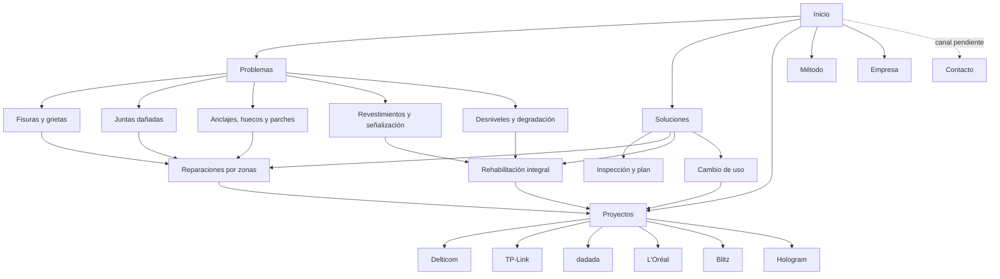

# Arquitectura del sitio

Estado documentado: 6 de septiembre de 2026. La web continúa en preview
`noindex,nofollow`; `Obraxen`, `obraxen.com` y los correos público/privacidad
están integrados. Razón social, NIF, domicilio y teléfono temporal están
declarados; formulario y publicación siguen bloqueados. La integración no
modifica rutas ni autoriza una salida pública.

Next.js App Router es la única implementación desde la Fase 4.5. Todas las rutas
actuales se prerenderizan en inglés, alemán, español y francés; los borradores
legales ya no dependen de plantillas legacy y el sitemap permanece vacío mientras
la publicación esté bloqueada.

Este documento distingue la estructura que ya existe de la arquitectura futura.
Una ruta planificada no se construye ni se publica hasta superar su puerta de
contenido, evidencia y capacidad.

## 1. Principio de navegación

La web debe acompañar la decisión del comprador mediante este recorrido:

> problema → riesgo operativo → inspección → intervención → control → evidencia

La estructura será plana: las páginas principales estarán a un clic del inicio y
los detalles a un segundo nivel. Los slugs internos de proyecto se conservan,
pero no generan rutas públicas hasta superar su puerta de evidencia.

## 2. Estructura actual multilingüe

```text
Raíz (/) → 308 /en/
├── English (/en/)
│   ├── Projects (/en/projects/) → hub sin casos públicos
│   ├── Legal notice (/en/legal-notice/)
│   ├── Privacy (/en/privacy/)
│   ├── Cookies (/en/cookies/)
│   └── Contact (/en/contact/) [cerrado]
├── Deutsch (/de/)
│   ├── Projekte (/de/projekte/) → hub sin casos públicos
│   ├── Impressum (/de/impressum/)
│   ├── Datenschutz (/de/datenschutz/)
│   ├── Cookies (/de/cookies/)
│   └── Kontakt (/de/kontakt/) [cerrado]
├── Español (/es/)
│   ├── Proyectos (/es/proyectos/) → hub sin casos públicos
│   ├── Aviso legal (/es/aviso-legal/)
│   ├── Privacidad (/es/privacidad/)
│   ├── Cookies (/es/cookies/)
│   └── Contacto (/es/contacto/) [cerrado]
└── Français (/fr/)
    ├── Projets (/fr/projets/) → hub sin casos públicos
    ├── Mentions légales (/fr/mentions-legales/)
    ├── Confidentialité (/fr/confidentialite/)
    ├── Cookies (/fr/cookies/)
    └── Contact (/fr/contact/) [cerrado]
```

Los seis casos permanecen en el registro interno. No reciben enlaces públicos,
no se prerenderizan y cualquier URL de ficha devuelve 404. Cuando un caso supere
su puerta, conservará el mismo slug en los cuatro idiomas y se incorporará a la
portada, al hub y a la navegación contextual en una sola entrega.

## 3. Arquitectura objetivo

El árbol siguiente expresa nombres españoles para describir la taxonomía. Cada
ruta que llegue a publicarse deberá vivir bajo su prefijo y tener equivalente
editorial completo en los otros tres idiomas; no se abrirán subárboles parciales.

```text
Inicio (/)
├── Problemas (/problemas/)
│   ├── Fisuras y grietas (/problemas/fisuras-y-grietas/)
│   ├── Juntas dañadas (/problemas/juntas-danadas/)
│   ├── Anclajes, huecos y parches (/problemas/anclajes-huecos-y-parches/)
│   ├── Revestimientos y señalización (/problemas/revestimientos-y-senalizacion/)
│   └── Desniveles y superficies degradadas (/problemas/desniveles-y-degradacion/)
├── Soluciones (/soluciones/)
│   ├── Inspección y plan de intervención (/soluciones/inspeccion-plan-intervencion/)
│   ├── Reparaciones localizadas (/soluciones/reparaciones-por-zonas/)
│   ├── Rehabilitación integral (/soluciones/rehabilitacion-integral-hormigon/)
│   └── Recuperación por cambio de uso (/soluciones/recuperacion-cambio-inquilino/)
├── Proyectos (/proyectos/)
│   └── Seis rutas actuales, sin cambiar sus slugs
├── Método (/metodo/)
├── Empresa (/empresa/)
├── Contacto (/contacto/) [bloqueada]
├── Guías (/guias/) [futuro]
├── Sectores (/sectores/) [futuro]
│   ├── Logística (/sectores/logistica/)
│   └── Industria y fabricación (/sectores/industria-fabricacion/) [por validar]
├── Aviso legal (/aviso-legal/)
├── Privacidad (/privacidad/)
└── Cookies y almacenamiento (/cookies/)
```

Las páginas individuales de problema son candidatas, no compromisos de
publicación. Se priorizarán por evidencia y utilidad comercial.

## 4. Mapa visual



## 5. Mapa de URLs y fases

| Página | URL | Acceso objetivo | Prioridad | Estado |
|---|---|---|---|---|
| Inicio | `/{lang}/` | Cabecera | Alta | Cuatro rutas; `/` redirige a `/en/` |
| Hub de proyectos | `/{lang}/{projects}/` | Cabecera y CTA de preview | Alta | Cuatro hubs sin expedientes públicos |
| Caso | `/{lang}/{projects}/{slug}/` | Portada, hub y anterior/siguiente | Alta | No generado; 404 hasta superar la puerta por expediente |
| Hub de soluciones | `/soluciones/` | Cabecera | Alta | Puerta preparada; ruta cerrada sin ofertas publicables |
| Solución | `/soluciones/{slug}/` | Hub y enlaces de problema | Alta | Borrador interno |
| Hub de problemas | `/problemas/` | Cabecera | Alta | Planificada |
| Problema | `/problemas/{slug}/` | Hub y enlaces contextuales | Media | Condicionada por evidencia |
| Método | `/metodo/` | Cabecera | Media | Planificada |
| Empresa | `/empresa/` | Cabecera y pie | Media | Planificada; sin fundador ni historia inventada |
| Contacto | `/en/contact/`, `/de/kontakt/`, `/es/contacto/`, `/fr/contact/` | CTA principal | Alta | Ruta preparada; formulario fail-closed |
| Logística | `/sectores/logistica/` | Contexto y pie | Media | Primera candidata; tres casos relacionados |
| Industria y fabricación | `/sectores/industria-fabricacion/` | Contexto y pie | Media | Validar especificidad de dos casos |
| Guías | `/guias/` | Contexto y pie | Baja | Fase posterior |
| Aviso legal | Segmento localizado bajo `/{lang}/` | Pie | Obligatoria | Cuatro borradores pendientes de revisión profesional |
| Privacidad | Segmento localizado bajo `/{lang}/` | Pie | Obligatoria | Cuatro borradores pendientes de revisión profesional |
| Cookies y almacenamiento | `/{lang}/cookies/` | Pie y panel de privacidad | Obligatoria si se activa medición | Cuatro borradores técnicos pendientes de revisión |

La estrategia internacional queda cerrada en ADR-010: los cuatro idiomas llevan
prefijo y el inglés es la entrada inicial. Las rutas españolas legacy redirigen
permanentemente a `/es/`; no se detecta idioma de forma obligatoria por navegador.

## 6. Navegación

### Navegación actual

- Se conservan Proceso, Servicios, Empresa y FAQ como anclas internas estables.
- Proyectos y los CTA de preview llevan al hub localizado porque no existe un
  canal real de contacto.
- El selector de idioma conserva inicio, hub, caso, legal o contacto equivalente.
- El logotipo vuelve al inicio.

### Navegación objetivo

Orden de cabecera:

1. Soluciones.
2. Problemas.
3. Proyectos.
4. Método.
5. Empresa.
6. CTA «Pide una evaluación», solo cuando exista contacto.

El pie agrupará Soluciones, Evidencia, Empresa y Legal. Sectores y Guías solo
aparecerán cuando contengan páginas publicables. No se crearán menús vacíos.

Cada detalle utilizará breadcrumbs alineados con su URL:

- `Inicio > Proyectos > Delticom`.
- `Inicio > Soluciones > Reparaciones localizadas`.
- `Inicio > Problemas > Juntas dañadas`.

## 7. Enlazado interno

Cada página de problema enlazará a:

1. la solución o soluciones que permiten evaluarlo;
2. al menos un caso que demuestre un alcance relacionado;
3. el método de inspección;
4. contacto cuando el canal esté activo.

Cada solución enlazará a sus límites, casos aplicables, problemas relacionados y
siguiente paso. Cada caso enlazará a la solución que acredita, sin presentar el
contexto del caso como prueba de prestaciones no medidas.

### Matriz inicial

| Problema | Solución principal | Casos relacionados |
|---|---|---|
| Fisuras y juntas | Reparaciones por zonas; rehabilitación integral | dadada, Blitz, Hologram |
| Anclajes, huecos y parches | Reparaciones por zonas; cambio de uso | TP-Link, Blitz, Hologram |
| Revestimientos y señalización | Rehabilitación integral; cambio de uso | Delticom, TP-Link, Hologram |
| Desniveles y degradación | Reparaciones por zonas; rehabilitación integral | dadada, Hologram |
| Superficie extensa y heterogénea | Rehabilitación integral | Delticom, L’Oréal, Hologram |

El contexto de cambio de inquilino no se atribuye a esos casos mientras no esté
confirmado; solo acreditan partidas compatibles con esa futura oferta.

## 8. Puertas de publicación

Una página de solución requiere:

- capacidad propia o red de socios confirmada;
- explicación técnica original;
- criterios de selección y límites;
- al menos un caso aplicable y autorizado;
- siguiente paso útil.

La inspección necesita además un protocolo e informe tipo. La recuperación por
cambio de uso necesita validación comercial y un estándar de entrega.

Una página de problema requiere:

- síntomas y riesgos explicados sin diagnosticar a distancia;
- alternativas y límites;
- enlace a una solución y caso aplicables;
- contenido suficiente para ser útil por sí misma.

Una página sectorial requiere:

- dos casos autorizados o evidencia equivalente;
- lenguaje del decisor;
- problemas, restricciones, normativa y mantenimiento propios del contexto.

Contacto, indexación y publicación siguen sujetos a revisión registral/marcaria,
revisión legal, proveedor, traducciones, permisos y autorización expresa.

## 9. Orden de implementación

1. ~~Consolidar el nuevo cierre de los seis casos.~~ Completado.
2. ~~Construir `/proyectos/` como hub de evidencia.~~ Completado.
3. ~~Migrar la base, portada y proyectos a Next.js con paridad, siguiendo las
   Fases 1–3 de `ROADMAP.md`.~~ Completado.
4. ~~Conectar `data/ofertas.json` a una puerta tipada `publicable`.~~ Completado;
   ninguna oferta la supera todavía.
5. ~~Completar legal, sitemap y cutover a Next como implementación única.~~
   Completado en la Fase 4.5.
6. ~~Implementar consentimiento básico, información de cookies y pruebas de red
   antes de cargar GA4 o Clarity.~~ Completado técnicamente en Fase 5; IDs reales,
   dominio y activación permanecen bloqueados.
7. ~~Definir inglés como entrada, prefijos en/de/es/fr, segmentos localizados,
   selector equivalente y redirecciones legacy.~~ Completado en ADR-010.
8. ~~Preparar contacto localizado y API fail-closed sin almacenamiento propio.~~
   Completado técnicamente en ADR-011; activación externa bloqueada.
9. Construir `/soluciones/` únicamente cuando existan ofertas que superen su
   condición de salida.
10. Crear `/problemas/` y las primeras páginas respaldadas por casos.
11. Separar Método y Empresa cuando sus contenidos estén cerrados.
12. Añadir Logística como primer sector si supera la revisión específica.
13. Activar Contacto, legal, SEO e indexación al completar las revisiones de
   naming y legal, los cuatro idiomas, proveedor y permisos.

## 10. Reglas de crecimiento

1. Los modelos viven en `data/*.json`; las páginas se prerenderizan desde
   componentes y rutas Next.js.
2. Los slugs son únicos, minúsculos y separados con guiones.
3. Ninguna página queda huérfana ni aparece en navegación antes de existir.
4. No se crean rutas geográficas por volumen aparente de búsqueda.
5. Las rutas actuales se conservan; cualquier cambio futuro exige redirección.
6. Tras cada integración se verifican enlaces, accesibilidad, rendimiento, SEO y
   datos estructurados.
